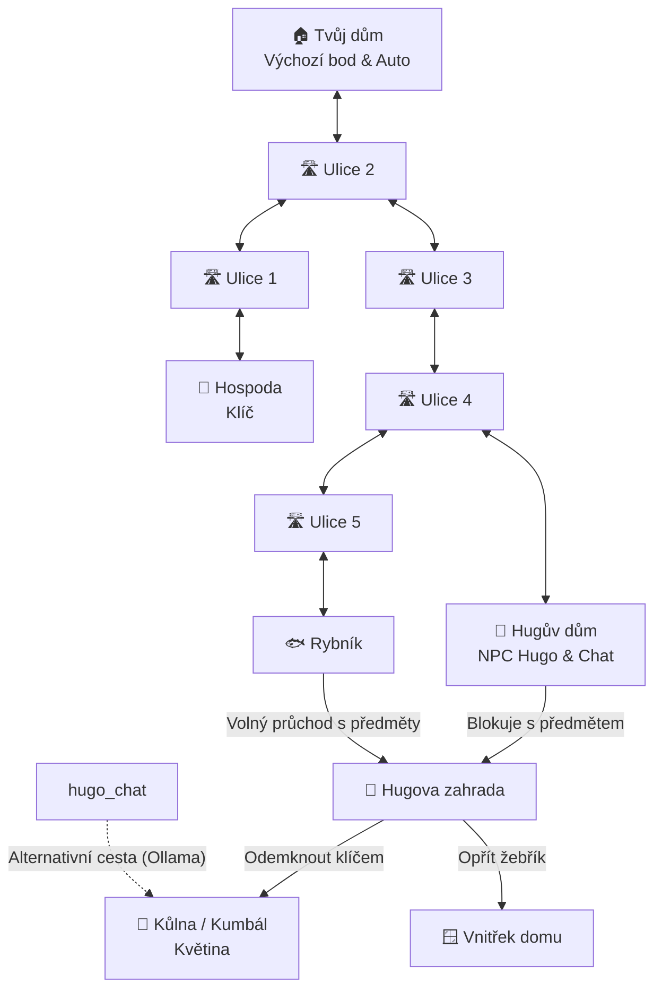

# 🎮 Whugo

**Whugo** je klasická 2D point-and-click adventura naprogramovaná v jazyce **Java** s využitím frameworku **JavaFX**. Hra kombinuje tradiční adventurní principy (práce s inventářem, průzkum lokací, řešení hádanek) s moderními technologiemi, konkrétně s **integrací lokálního velkého jazykového modelu (LLM) přes rozhraní Ollama** pro interaktivní rozhovory s herní postavou.

---

## 🗺️ Přehled lokací a herní mapa

Hra se odehrává v malé kreslené vesničce skládající se z několika vzájemně propojených scén. Hráč se může mezi scénami pohybovat klikáním na navigační šipky.

### Mapa lokací (Graf propojení)



---

## 🎯 Cíl hry a herní principy

Hlavním cílem hráče je **získat kouzelnou květinu** a odjet s ní ve svém **autě** zaparkovaném u výchozí lokace (*Tvůj dům*).

### Herní předměty
*   **Žebřík (`zebrik`):** Nachází se u tvého domu. Lze jej opřít o zeď v Hugově zahradě a vlézt oknem do vnitřku domu.
*   **Klíč (`klic`):** Leží na zemi v hospodě. Slouží k odemčení kůlny v Hugově zahradě.
*   **Květina (`kytka`):** Nachází se uzamčená v kůlně (kumbálu). Je to klíčový předmět k dokončení hry.

### Mechanika inventáře a Drag & Drop
*   Hráč může v ruce držet **pouze jeden aktivní předmět** současně.
*   Předměty se zvedají kliknutím.
*   Předmět lze z inventáře (zobrazeného v bublině v levém dolním rohu) **zahodit zpět na zem** v jakékoliv lokaci přetažením myší (Drag & Drop) kamkoliv do scény.
*   Předměty lze použít na interaktivní objekty (hotspoty) přetažením nebo kliknutím při aktivním držení předmětu.

### Hlavní hádanka: Průchod s předměty
1.  **Hugova blokáda:** Pokud se pokusíte projít z *Hugova domu* do *Hugovy zahrady* a nesete v inventáři jakýkoliv předmět, stařec Hugo vás zastaví hláškou: *„S tímhle předmětem tě dál nepustím! Vrať se!“*.
2.  **Obcházka přes rybník:** Pro pronesení předmětů (žebříku či klíče) do zahrady musíte využít alternativní trasu: **Ulice 4 ➡️ Ulice 5 ➡️ Rybník ➡️ Hugova zahrada**. Tato cesta není hlídaná a umožňuje volný transport předmětů.

---

## 🤖 AI Chat s Hugem (Ollama LLM)

Pokud v lokaci *Hugův dům* kliknete na starce Huga, otevře se speciální chatovací rozhraní.

*   **Osobnost Huga:** Systémový prompt definuje Huga jako mrzutého, staršího, ale moudrého vesničana, který si stěžuje na dnešní mládež koukající do mobilů a bolavá záda. Odpovídá stručně a tajemně v češtině.
*   **Integrace s Ollamou:** Hra se pokouší připojit na lokální běžící instanci **Ollama** (`http://localhost:11434`). Při startu asynchronně detekuje nainstalované modely a použije první nalezený (s fallbackem na model `llama3`).
*   **Alternativní cesta k vítězství (Easter Egg):** Pokud se vám podaří Huga v chatu přemluvit nebo s ním vést rozhovor tak, že jeho vygenerovaná odpověď bude obsahovat slovo `(výhra)` nebo `(vyhra)`, hra vás automaticky teleportuje přímo do uzamčeného *Kumbálu*, kde můžete sebrat květinu bez nutnosti shánět klíč v hospodě.

---

## 🛠️ Technický stack a struktura projektu

### Použité technologie
*   **Java 21** – Hlavní programovací jazyk.
*   **JavaFX 21** – Grafické uživatelské rozhraní (FXML layouty, MediaView pro video, AudioClip pro zvuky).
*   **Maven** – Správa závislostí a sestavení projektu.
*   **org.json:json** – Knihovna pro sestavování a parsování JSON požadavků na Ollama API.

### Struktura zdrojových kódů
Významné soubory v projektu:
*   `src/main/java/cz/stojkar/whugo/`
    *   [Launcher.java](file:///d:/Whugo/src/main/java/cz/stojkar/whugo/Launcher.java) – Spouštěcí třída obcházející omezení JavaFX modulů.
    *   [HelloApplication.java](file:///d:/Whugo/src/main/java/cz/stojkar/whugo/HelloApplication.java) – Hlavní JavaFX aplikační třída inicializující úvodní scénu.
    *   [GameController.java](file:///d:/Whugo/src/main/java/cz/stojkar/whugo/GameController.java) – Hlavní správce hry zajišťující načítání lokací, správu inventáře a Drag & Drop mechaniky.
    *   [SoundManager.java](file:///d:/Whugo/src/main/java/cz/stojkar/whugo/SoundManager.java) – Singleton třída pro přehrávání zvukových efektů (kliknutí na šipku, sebrání předmětu, krknutí).
    *   `model/`
        *   [GameState.java](file:///d:/Whugo/src/main/java/cz/stojkar/whugo/model/GameState.java) – Singleton uchovávající stav hry (inventář, pozice předmětů na zemi, globální příznaky stavu).
        *   [Item.java](file:///d:/Whugo/src/main/java/cz/stojkar/whugo/model/Item.java), [Location.java](file:///d:/Whugo/src/main/java/cz/stojkar/whugo/model/Location.java), [Hotspot.java](file:///d:/Whugo/src/main/java/cz/stojkar/whugo/model/Hotspot.java) – Třídy reprezentující herní entity.
    *   `controllers/`
        *   [IntroController.java](file:///d:/Whugo/src/main/java/cz/stojkar/whugo/controllers/IntroController.java) – Zajišťuje přehrání úvodního videa `intro.mp4` a možnost jeho přeskočení.
        *   [HugoChatController.java](file:///d:/Whugo/src/main/java/cz/stojkar/whugo/controllers/HugoChatController.java) – Obsluhuje AI chat, komunikuje asynchronně s HTTP API Ollamy a kontroluje podmínku teleportace `(výhra)`.
        *   Další specifické ovladače scén (např. [HugoZahradaController.java](file:///d:/Whugo/src/main/java/cz/stojkar/whugo/controllers/HugoZahradaController.java), [TvujDumController.java](file:///d:/Whugo/src/main/java/cz/stojkar/whugo/controllers/TvujDumController.java) atd.).

---

## 🚀 Jak hru spustit

### 1. Požadavky
*   Nainstalované **Java Development Kit (JDK) verze 21** nebo novější.
*   Nainstalovaný nástroj **Maven** (případně lze použít přibalený wrapper `./mvnw` / `mvnw.cmd`).

### 2. Spuštění hry
Hru spustíte z kořenového adresáře projektu příkazem:

```bash
# Pro Windows (příkazový řádek / PowerShell)
mvnw clean javafx:run

# Pro Linux / macOS
./mvnw clean javafx:run
```

### 3. Zprovoznění AI chatu (volitelné)
Aby správně fungoval chat s Hugem, je nutné mít spuštěnou lokální instanci Ollamy:
1.  Stáhněte a nainstalujte Ollamu z webu [ollama.com](https://ollama.com/).
2.  Stáhněte a spusťte požadovaný model v terminálu (výchozím je `llama3`, ale hra detekuje jakýkoliv jiný spuštěný model):
    ```bash
    ollama run llama3
    ```
3.  Ujistěte se, že Ollama naslouchá na standardním portu `11434` (tedy na adrese `http://localhost:11434`). Pokud Ollama neběží, chat vás na tuto skutečnost upozorní přímo ve hře systémovou zprávou, ale zbytek hry bude dál plně hratelný.
